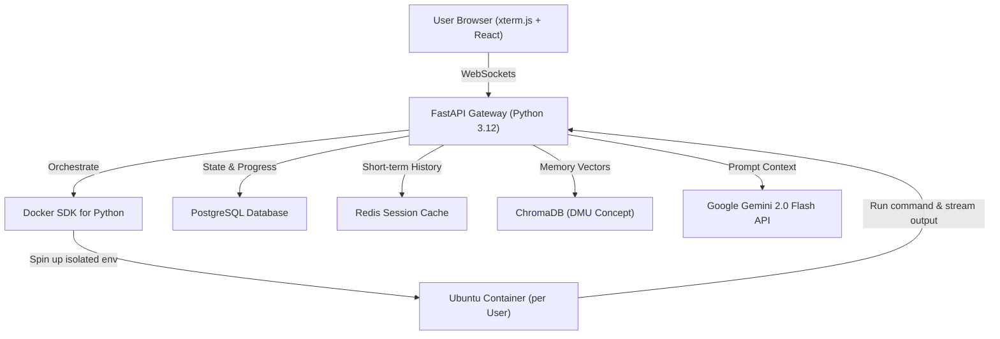

# 🚀 LOTUS Academy: Product & Architecture Blueprint

This document defines the roadmap for transition from the private alpha landing page and static demo workspace to a fully scaled, secure, interactive learning product.

---

## 1. The LOTUS Academy Full Tech Stack

To scale the live WebSocket terminal execution loop while ensuring host safety and real-time responsiveness, LOTUS is deployed on the following stack:



### Frontend (User Experience & Shell)
*   **Framework:** React + TypeScript + Vite.
*   **Terminal Emulator:** `xterm.js` (Industry standard for rendering clean, raw, color-formatted terminal output and capturing raw key sequences).
*   **Styling:** Tailwind CSS (Minimal dark design system utilizing the gold/ink palette).
*   **Hosting:** Vercel (Production builds serving static assets instantly).

### Backend (The Brain & The Logic)
*   **Framework:** Python 3.12 + FastAPI (Handling bidirectional, asynchronous WebSocket connections without thread blocks).
*   **AI Engine:** Google Gemini 2.0 Flash (Chosen for sub-second latency, long context capability, and precise tool call generation).
*   **Database & Memory Layers:**
    *   **PostgreSQL:** Persists user registration, student subscription levels, and detailed billing/progress records.
    *   **Redis:** Retains transient session history (command log of the last 15 minutes to feed the active prompt buffer).
    *   **ChromaDB:** Implements the Decision Memory Unit (DMU) to index semantic concepts, user strengths, and weaknesses across months.

### Execution Sandbox (The Danger Zone)
*   **Isolation Engine:** Docker API. Commands like `sudo`, `apt install`, and file alterations MUST run in absolute isolation.
*   **Life Cycle:**
    1.  When a user establishes a WebSocket connection, FastAPI calls the Docker SDK to initialize a lightweight, unprivileged Ubuntu container specifically for that user session.
    2.  User commands are sanitized, tokenized, and piped into the container shell using `docker exec`.
    3.  Outputs (stdout/stderr) are streamed back to the frontend in real time.
    4.  Upon user disconnection, the container is immediately destroyed, leaving zero persistent foot prints or cross-tenant exposure.

---

## 2. The Curriculum Generation Prompt (Meta-Prompt)

This prompt is used by LOTUS AI curators to generate structured, step-by-step interactive lessons compatible with the Mondo terminal-monitoring loop:

```
You are the Lead Curriculum Architect for LOTUS Academy.
LOTUS is not a traditional learning platform. It is a live, interactive AI environment. 

The student sits at a split-screen UI: a chat window with their AI teacher ("Mondo") and a live, sandboxed Linux terminal. 
Mondo can see the student's terminal output BEFORE Mondo responds. 

Your job is to design a learning module. Do NOT give me textbook explanations, multiple-choice quizzes, or walls of text. 

Design the module using the LOTUS Loop:
1. GROUND: Hook the user with a real-world reason why this matters.
2. TRY: Give them a specific, safe terminal command to run. 
3. EXPLAIN: Explain what just happened based on the output they generated.
4. REWARD: Make the result visually satisfying or empowering.

For the requested topic, provide a 5-step interaction script. 
For each step, define:
- The Concept: What are we learning?
- Mondo's Hook: What Mondo says to the user to get them to type.
- The Command: The exact bash command the user must execute.
- The "Aha!" Moment: What the terminal output will show and how Mondo should react to it to make the user feel like a hacker.
- Error Handling: What Mondo should say if the user typos the command or gets frustrated.

Topic to design: [INSERT TOPIC HERE]
```

---

## 3. The 2-Hour Trial Run: Terminal Power & sudo

This 5-step interaction is designed to introduce standard command concepts, permissions, package installation, and execution to beginners through a satisfying narrative arc.

### Step 1: The Pulse Check
*   **Concept:** `echo` and basic interaction.
*   **Mondo's Hook:** "You’re sitting in front of a raw machine. It’s deaf and blind until you speak to it. Let's see if it's awake. Tell it to say hello back to you."
*   **The Command:** `echo "I am in the machine"`
*   **The "Aha!" Moment:** The terminal instantly spits the words back. It's direct text-to-metal feedback.
*   **Mondo's Response:** "There it is. You give the command, it executes. No UI, no clicking. Just raw text to metal. But right now, you don't know where you are. Let's map the room."

### Step 2: The Map
*   **Concept:** `pwd` and `ls -la`.
*   **Mondo's Hook:** "If you're going to break things or build things, you need to know where you're standing. Find your coordinates."
*   **The Command:** `pwd` followed by `ls -la`
*   **The "Aha!" Moment:** The user sees `/home/jude` and a list of permission attributes and hidden files, realizing the system is a structured filing cabinet.
*   **Mondo's Response:** "You see those letters on the left? `drwxr-xr-x`? Those are locks. Some doors you can open. Some you can't. Let's try to bring something new into this system."

### Step 3: The Library
*   **Concept:** `apt search` and Package Managers.
*   **Mondo's Hook:** "Your machine is barebones right now. But Linux has massive warehouses of free software just sitting out there. It’s called Advanced Package Tool—apt. Let's search the warehouse for something visual. Look for the matrix."
*   **The Command:** `apt search cmatrix`
*   **The "Aha!" Moment:** The terminal queries the package repository and returns matching entries, showing the user they have global software repositories at their fingertips.
*   **Mondo's Response:** "Found it. `cmatrix` simulates the falling green code from The Matrix. Pull it down. Install it."

### Step 4: The Bouncer
*   **Concept:** Access Denied & `sudo` elevation.
*   **Mondo's Hook:** "Go ahead. Tell the machine to install it."
*   **The Command:** `apt install cmatrix` (Fails with a Permission Denied error)
*   **The "Aha!" Moment:** Frustration. The system refuses because standard users lack write rights to `/var/lib/dpkg/`.
*   **Mondo's Response:** "Denied. You're just a standard user right now. The machine doesn't trust you to install software. You have to tell the machine that you are acting with the authority of the Super User. You need `sudo` (Super User DO). Try it again, but this time, speak with authority."
*   **The Real Command:** `sudo apt install cmatrix`

### Step 5: The Reward
*   **Concept:** Execution & flow state.
*   **Mondo's Hook:** "The bouncer stepped aside. The software is installed. Run the program."
*   **The Command:** `cmatrix`
*   **The "Aha!" Moment:** The user's screen is taken over by falling green matrix code. They successfully navigated, elevated credentials, and modified the environment.
*   **Mondo's Response:** "Yeah, that's it. You commanded it, you elevated your privileges, and you altered the environment. Hit Ctrl+C to stop it when you're ready to learn how to weaponize this."
